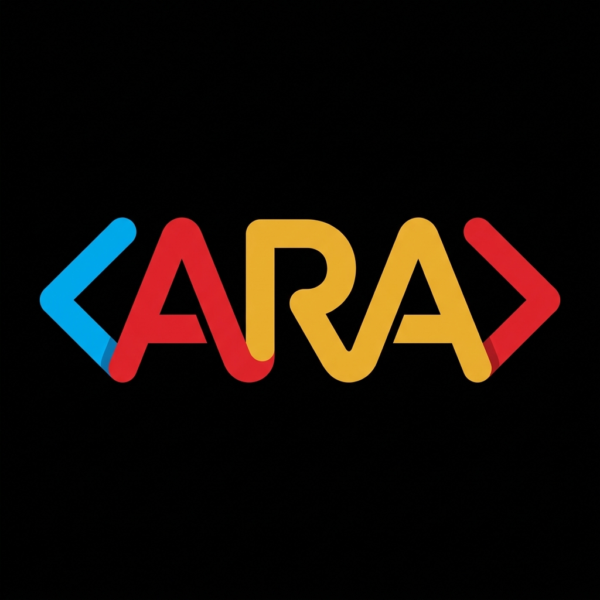

<div align="center">

<br/>



<h1>ARA</h1>

<h3>Autonomous Reasoning Agent</h3>

<p><strong>The Python SDK for agents that think, plan, and decide for themselves.</strong></p>

<br/>

<a href="https://pypi.org/project/ara-python"></a>
<a href="https://python.org"></a>
<a href="LICENSE"></a>


<br/><br/>

<code>pip install ara-python</code>

<br/><br/>

</div>

---

## What is ARA?

**ARA (Autonomous Reasoning Agent)** is a ReAct-based Python agent SDK built around one belief:

> **The agent should be the architect — not you.**

Every other agent framework — LangGraph, CrewAI, Google ADK, OpenAI Agents SDK, AutoGen —
asks you to pre-define the execution strategy, agent topology, and tool set before the agent runs.

ARA flips this. You give ARA a **goal**. ARA figures out the rest.

```python
pip install ara-python
```

```python
import ara

# You describe what you want.
# ARA decides how to get there.
result = await ara.pursue(
    goal="Research the top 5 Indian AI startups of 2025 and write a structured report",
    constraints=["Public sources only", "Complete within 5 minutes"],
    output=Report,
)
print(result.output)
```

No pre-wired agents. No hand-coded tool lists. No strategy you choose upfront.
ARA is an **Autonomous Reasoning Agent** — it reasons about *how* to solve your goal,
not just *what* answer to give.

---

## Why ARA Exists

Every framework today shares a hidden assumption:

```
Developer defines the map  →  Agent navigates it
```

You choose: ReAct or Planner? How many agents? Which tools? When to hand off?
The LLM provides the intelligence. The framework is still dumb scaffolding.

**ARA's model:**

```
Developer defines the destination  →  ARA draws the map AND navigates it
```

---

## The 7 Things That Make ARA Different

<details>
<summary><strong>D1 — Adaptive Strategy Selection</strong> &nbsp;→&nbsp; The agent picks its own execution pattern per task</summary>

<br/>

No other framework lets the agent choose how it will solve a task.
You commit to ReAct, or Planner, or a Crew — before you know what the task needs.

ARA runs a **Strategy Selector** before every task:

```
Task received
    │
    ▼
  Strategy Selector  (lightweight, fast)
  ├── Simple lookup?          → single-shot (no loop overhead)
  ├── Multi-step reasoning?   → ReAct loop
  ├── Complex long-horizon?   → Planner: decompose first, then execute
  └── Needs multiple experts? → Spawn a multi-agent topology on-demand
```

The right strategy is chosen *per task*, not *per agent definition*.

</details>

<details>
<summary><strong>D2 — Dynamic Agent Spawning</strong> &nbsp;→&nbsp; Agents create other agents at runtime</summary>

<br/>

Every other framework requires you to pre-register all agents before a run starts.
Handoffs are hard-coded. The topology is fixed.

In ARA, an orchestrator can **spawn new specialist agents at runtime** — with exactly the right
role, tools, and model for the job — and terminate them when done.

```python
# You write this:
result = await ara.pursue(goal="Analyze our Q4 financials and write a cost reduction plan")

# ARA decides this at runtime (zero developer involvement):
# → spawns DataAnalystAgent(tools=[csv_reader, calculator])
# → spawns ReportWriterAgent(tools=[file_write])
# → coordinates them, synthesizes output, terminates agents
# → returns structured result
```

This is not pre-wired delegation. This is **emergent agent topology**.

</details>

<details>
<summary><strong>D3 — Meta-Cognition Loop</strong> &nbsp;→&nbsp; The agent watches and corrects itself mid-run</summary>

<br/>

No existing framework has a built-in self-monitoring layer.

ARA ships a **Meta-Cognition** process that runs alongside every agent and detects:

| Signal detected | ARA's action |
|----------------|-------------|
| Same tool called 3× with identical args | Injects: *"You may be stuck. Try a different approach."* |
| Hedging language in last 2 responses | Injects: *"You seem uncertain. Verify before proceeding."* |
| 5 iterations with no progress toward goal | Injects: *"Decompose the task differently."* |
| 80% of tokens spent on irrelevant context | Compresses and re-focuses the context window |

This is the machine equivalent of: *"Wait — am I even going about this the right way?"*

</details>

<details>
<summary><strong>D4 — Goal-Oriented Input</strong> &nbsp;→&nbsp; You express WHAT, ARA figures out HOW</summary>

<br/>

Every framework takes **instructions** as primary input.
You write the role, the persona, the exact behavior you want.

ARA introduces a **Goal layer** above instructions:

```python
# Traditional SDK — you are the system designer:
Agent(
    instructions="You are a research assistant. When asked a question, search the web, "
                 "read the top 3 results, summarize them, and return a structured report...",
    tools=[search, read_page, summarize],
)

# ARA — you express intent:
ara.pursue(
    goal="Find all SEBI-registered AIF funds that disclosed AI investments in FY2025",
    constraints=["Public SEBI filings only", "Structured data output"],
    output_schema=FundReport,
)
# ARA decomposes the goal, identifies tools needed,
# spawns or reuses agents, executes — autonomously.
```

</details>

<details>
<summary><strong>D5 — Composable Autonomy Levels</strong> &nbsp;→&nbsp; 4 levels of human oversight, not binary on/off</summary>

<br/>

Every framework treats human-in-the-loop as binary: either there's an approval gate or there isn't.

ARA introduces **4 Autonomy Levels**, configurable per-agent and per-tool in the same workflow:

| Level | Name | What it means |
|-------|------|--------------|
| **L0** | Supervised | Every action requires human approval before execution |
| **L1** | Guided | ARA plans autonomously. You approve the plan. Execution is automatic. |
| **L2** | Autonomous | Fully automatic. You see output. Can intervene but don't have to. |
| **L3** | Background | Runs silently. Notifies only on completion, blockers, or anomalies. |

```python
ara.pursue(
    goal="Send follow-up emails to all leads from last week",
    autonomy={
        "draft_email": AutonomyLevel.L2,  # auto-draft, no approval needed
        "send_email":  AutonomyLevel.L0,  # always ask before sending
        "crm_lookup":  AutonomyLevel.L3,  # silent background reads
    }
)
```

</details>

<details>
<summary><strong>D6 — ARA is a Runtime, Not Just a Library</strong> &nbsp;→&nbsp; Deploy agents as a server, not just a script</summary>

<br/>

Every other framework is a library. You call it per request. It runs. It returns.

**ARA is a long-running agent runtime:**

```bash
ara serve --config ara.yaml
```

- Accepts tasks via HTTP, gRPC, or message queue
- Manages a pool of autonomous agent instances
- Schedules tasks with priority, delay, and dependencies
- Reports live status on any running agent
- Supports background agents that run for hours or days

```
  HTTP / gRPC / Queue
          │
          ▼
    ┌─────────────────────────────┐
    │        ARA Runtime          │
    │  ┌──────────────────────┐   │
    │  │    Agent Pool        │   │
    │  │  A    B    C    D    │   │
    │  └──────────────────────┘   │
    │  State Store | Trace Store  │
    └─────────────────────────────┘
```

</details>

<details>
<summary><strong>D7 — Reasoning as a Programmable Interface</strong> &nbsp;→&nbsp; Inject logic into the agent's thinking, not just its tools</summary>

<br/>

In every other framework, the agent's internal reasoning is a black box.
You see tool calls. You see output. You cannot touch the thinking.

**ARA exposes the reasoning chain as a first-class programmable interface:**

```python
@ara.reasoning_hook(phase="before_decision")
def inject_compliance_rules(thought: ThoughtStep, ctx: RunContext) -> RunContext:
    # Runs before every agent decision — inject domain rules into working context
    if "financial" in thought.text.lower():
        ctx.inject("Always cite specific SEBI regulation numbers.")
    return ctx
```

You can inject context, intercept decisions, modify working memory, or A/B test
different reasoning strategies — all without touching the agent definition.

</details>

---

## Quick Start

```bash
pip install ara-python
```

**Minimal — 5 lines:**
```python
import ara

result = await ara.pursue("Summarize today's top AI news")
print(result.output)
```

**Full control:**
```python
from ara import Agent, tool, AutonomyLevel
from pydantic import BaseModel

class NewsReport(BaseModel):
    headlines: list[str]
    summary: str
    sources: list[str]

@tool(description="Search the web for recent news articles")
async def search_news(query: str, days: int = 1) -> list[dict]: ...

agent = Agent(
    name="news-researcher",
    model="gemini-2.0-flash",
    tools=[search_news],
    autonomy=AutonomyLevel.L2,
    max_iterations=10,
)

result = await agent.pursue(
    goal="Find the top 5 AI stories from the last 24 hours",
    output_schema=NewsReport,
)

print(result.output.summary)
print(f"Ran {result.iterations} iterations | {result.tokens_used} tokens")
```

---

## ARA vs. Other Frameworks

```
                      High Autonomy
                            ▲
                            │
               [ ARA ]      │   ← agent is the architect
                            │
      LangGraph ────────────┼────────────  AutoGen
                            │
      Google ADK            │   CrewAI
                            │
      OpenAI Agents SDK     │   Semantic Kernel
                            │
   Low Autonomy             ▼
   ─────────────────────────────────────────────►
                Complex ←──────────────► Simple
                          (to set up)
```

ARA is **high-autonomy AND simple to start with**. That gap is the moat.

| Feature | ARA | LangGraph | CrewAI | OpenAI SDK |
|---------|-----|-----------|--------|------------|
| Agent picks its own execution strategy | ✅ | ❌ | ❌ | ❌ |
| Agents spawn new agents at runtime | ✅ | ❌ | ❌ | ❌ |
| Built-in meta-cognition / self-correction | ✅ | ❌ | ❌ | ❌ |
| Goal-oriented input | ✅ | ❌ | ❌ | ❌ |
| Composable autonomy levels (4 levels) | ✅ | ❌ | ❌ | Partial |
| Runtime server mode | ✅ | ❌ | ❌ | ❌ |
| Reasoning hooks (programmable thinking) | ✅ | ❌ | ❌ | ❌ |
| MCP support | ✅ | Partial | ❌ | ✅ |
| Model agnostic | ✅ | ✅ | ✅ | ✅ |

---

## Architecture

```
┌──────────────────────────────────────────────────────────┐
│                       ARA Runtime                        │
│                                                          │
│  ┌────────────────────────────────────────────────────┐  │
│  │               Strategy Selector                   │  │
│  │   Single-shot │ ReAct │ Planner │ Multi-Agent      │  │
│  └───────────────────────┬────────────────────────────┘  │
│                          │                               │
│  ┌───────────────────────▼────────────────────────────┐  │
│  │            ReAct Execution Engine                  │  │
│  │     THINK ──► ACT ──► OBSERVE ──► THINK ...        │  │
│  │          (LLM-driven stop via finish_reason)        │  │
│  └──────┬──────────────────────────┬──────────────────┘  │
│         │                          │                     │
│  ┌──────▼──────┐          ┌────────▼──────────────────┐  │
│  │    Tools    │          │   Meta-Cognition Layer     │  │
│  │   Skills    │          │   (self-monitoring critic) │  │
│  │ MCP Servers │          └───────────────────────────┘  │
│  └─────────────┘                                         │
│                                                          │
│  ┌──────────────────────────────────────────────────┐    │
│  │  Memory │ State │ Observability │ Guardrails     │    │
│  └──────────────────────────────────────────────────┘    │
└──────────────────────────────────────────────────────────┘
```

---

## Roadmap

- [ ] Core ReAct Engine (sync + async, LLM-driven stop)
- [ ] Tool System + Built-in Tools (search, code exec, HTTP, file)
- [ ] Skills System (bundled capability packs)
- [ ] MCP Client Integration
- [ ] Strategy Selector (adaptive execution)
- [ ] Meta-Cognition Loop (self-monitoring)
- [ ] Multi-Agent + Dynamic Spawning
- [ ] Memory Layers (working, session, long-term, RAG)
- [ ] Composable Autonomy Levels (L0–L3)
- [ ] Reasoning Hooks API
- [ ] ARA Runtime (server mode + task queue)
- [ ] CLI + Local Dev Playground (`ara dev`)
- [ ] Evaluation Framework
- [ ] `ara-python` on PyPI

---

## Philosophy

> **Simple things simple. Complex things possible. Autonomous things automatic.**

ARA is built on three beliefs:

1. **The agent should be the architect** — not you
2. **Autonomy should be composable** — not binary on/off
3. **The reasoning process should be programmable** — not a black box

---

## Requirements & Design Docs

Full requirements are in [`/requirements`](requirements/):

- [`00_INDEX.md`](requirements/00_INDEX.md) — Full mindmap of all modules
- [`16_differentiators.md`](requirements/16_differentiators.md) — The moat, in detail

---

## Contributing

ARA is being built in the open. Issues, ideas, and PRs welcome.

Read [`CONTRIBUTING.md`](CONTRIBUTING.md) to get started.

---

## License

MIT © 2025 ARA Contributors

---

<div align="center">

<br/>

**ARA — Autonomous Reasoning Agent**

*The agent SDK where the agent is the architect.*

<br/>

`pip install ara-python`

<br/>

</div>
